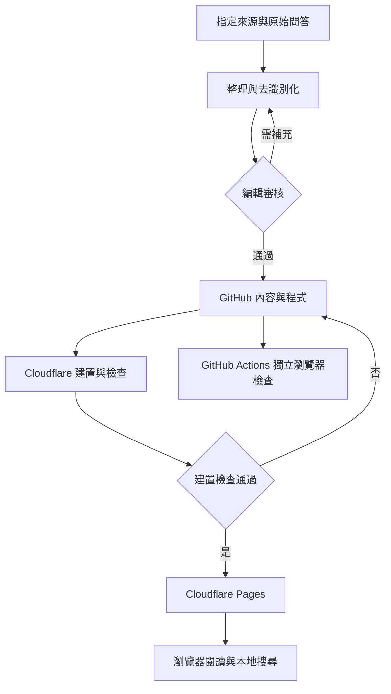

# 知識衛星 AI 分身課程問答庫｜技術 Spec

> 2026-09-18 網址遷移：Hans 指定 https://sathans.pages.dev；已建立的 sathans Pages 專案沿用原 repository。新網址尚待公開部署驗收，舊站持續服務。這是網站網址，不是問答來源。以下先前部署敘述屬歷史背景；最新狀態見 CLOUDFLARE.md 與 ACCEPTANCE.md。

- 文件版本：1.3
- 狀態：實作基準；網站架構已完成首版實作，實際驗證結果另列於交付專案 docs/ACCEPTANCE.md，不將全部規劃測例視為已通過
- 日期：2026-09-17
- 對應需求：[sat-ai-avatar-qa-PRD.md](PRD.md)
- repository：hansai-art/sat-ai-avatar-qa，已建立 public
- 目標：GitHub 管理程式與經整理的公開內容，Cloudflare Pages 建置與發布；GitHub Actions 品質檢查，GitHub Pages 保留備用。
- 閱讀權限：Hans 已確認公開閱讀，不設登入。正式問答、圖片與影片由 Hans 提供；開發端負責架構與內容格式。

> 2026-09-18 部署更新：已建立公開 repository [hansai-art/sat-ai-avatar-qa](https://github.com/hansai-art/sat-ai-avatar-qa)，Cloudflare Pages 已發布 [demo 示範站](https://sat-ai-avatar-qa.pages.dev)。main 透過 Git integration 自動發布；GitHub Actions 獨立執行品質檢查，Cloudflare 不等待其結果。GitHub Pages 停用。正式內容與課綱審核仍待 Hans 提供與確認；實測證據見 [ACCEPTANCE.md](ACCEPTANCE.md)。

## 1. 架構與責任

### 1.1 選型定案

| 層次 | 採用方式 | 責任 |
|---|---|---|
| 內容正本 | GitHub 中的 Markdown | 每題一檔、可追溯修改 |
| 分類正本 | 一份 taxonomy.json | 章節、小節、工具、問題類型與別名 |
| 網頁 | Astro 靜態輸出 | 首頁、列表、分類、問題詳情及 404 |
| 全文搜尋 | Pagefind npm（CJK 分詞）Node API＋瀏覽器 API | 索引、中文搜尋、篩選、排序 |
| 互動 | 原生 HTML、CSS、少量 TypeScript | 表單、搜尋狀態、分頁、複製連結 |
| 品質檢查 | Astro schema／型別＋少量驗證程式 | 資料、引用、產物與路徑檢查 |
| 測試 | Node 內建測試＋Playwright 瀏覽器測試 | 有風險的純邏輯與真實搜尋流程 |
| 部署 | Cloudflare Pages Git integration | 建置成功後發布同一份 dist；GitHub Pages 保留備用 |

不加入 React、資料庫、會員系統、向量搜尋、獨立 API server 或任務佇列。Markdown 資料夾就是 V1 的內容資料庫，Pagefind 產物是衍生搜尋索引，不是第二份可編輯正本。

第一版的網站互動不呼叫 AI。AI 僅在編輯流程外協助整理檔案。

### 1.2 資料流與分支



原始資料留在非公開工作區，只有整理後、可公開的資料進入 GitHub。學生端只接收已建置的公開 HTML、圖片與搜尋索引。

### 1.3 版本管理

採用彼此相容的 Astro 穩定版、Pagefind npm、Node LTS 與 npm，記錄確切版本於 package.json、package-lock.json、.nvmrc 與 README。CI 使用 npm ci，不能每次執行漂移到 latest。

實際套件已依 package.json 與 package-lock.json 釘選，Node 使用 .nvmrc，版本與實測結果見 README／驗收紀錄；升級必須重跑中文搜尋、base path、內容 schema 與部署測例。

## 2. 程式與內容目錄

以下為程式與內容的責任分配。實作將部分純邏輯放在可由 Node 直接測試的 .mjs 檔，對應關係見交付專案 docs/IMPLEMENTATION.md。

| 路徑 | 用途 |
|---|---|
| .github/workflows/check.yml | Pull Request 品質檢查，不部署 |
| .github/workflows/deploy.yml | GitHub Pages 歷史備用，已停用 |
| docs/PRD.md、docs/SPEC.md | 將本次兩份文件放入專案後的標準位置；同步更新互相連結 |
| src/content/questions/qa-000001.md | 公開可編輯的問答檔案 |
| src/data/taxonomy.json | 所有分類與工具別名 |
| src/assets/questions/qa-000001/ | 對應問答的已處理圖片 |
| src/content.config.ts | Astro Content Collection schema |
| src/lib/content.ts | 資料驗證、發布篩選、分類查詢與相關問題 |
| src/lib/paths.ts | 唯一的站內網址／base path 組合工具 |
| src/lib/search-state.ts | URL 參數解析、輸入正規化與條件序列化 |
| src/layouts/BaseLayout.astro | 共同頁框、meta、導覽 |
| src/components/ | 搜尋介面、問題卡片、標籤、來源、影片連結等必要元件 |
| src/pages/ | 本 Spec 第 4 節的靜態路由 |
| src/styles/global.css | 基本樣式與響應式排版 |
| public/ | favicon 等已確認可公開的固定資產；不放原始輸入、草稿或影片 |
| scripts/validate-output.mjs | 建置產物、連結、草稿與索引排除檢查 |
| tests/ | 純邏輯測試、搜尋瀏覽器測例及完全虛構的 fixtures |
| README.md | 開發、編輯、發布、回復及現行版本 |
| CHANGELOG.md | 重大功能與內容結構異動，不重抄每次 Git diff |

路徑可因實作縮減，但不能為只有一種實作的功能預建抽象框架。public/ 的檔案會直接進入發布產物，因此不能將「不想顯示」當成「不會公開」。

.gitignore 至少排除 node_modules/、dist/、.astro/、.env*（可保留無秘密的 .env.example）、.local-input/、playwright-report/、test-results/。忽略規則不能抹除已提交的 Git 歷史；敏感原始資料從一開始就不放入公開 repository。

## 3. 資料契約

### 3.1 問答識別

- 檔名固定為 qa-六位數字.md，例如 qa-000001.md；檔名去副檔名即 canonical ID。
- ID 建立後不因改標題、章節或合併而重新使用。
- V1 的新 ID 由編輯者確認目前最大值後分配；CI 會拒絕重複 ID，並行編輯碰撞在合併時處理。
- 固定路由為 /questions/qa-000001/；不使用標題當網址。
- 不另存重複的 frontmatter id，避免檔名與欄位不同步。
- Astro loader 明確設定 ID 生成規則，使 entry.id 等於檔名去掉 .md，而非依賴版本預設。

### 3.2 Frontmatter 欄位

所有欄位以 schema 驗證；未知欄位使建置失敗，避免拼錯後被忽略。長度以 Unicode code point 計，不用 UTF-16 字數當中文長度。

| 欄位 | 型別／預設 | 規則 |
|---|---|---|
| title | string，必填 | 4～100 字元；描述單一問題 |
| summary | string，必填 | 15～240 字元；純文字簡答，不含 HTML |
| chapterRefs | string[]，必填 | 至少一筆；已確認章節 ID，或 general；去重 |
| lessonRefs | string[]，預設 [] | 必須存在且其 chapterId 包含於 chapterRefs |
| toolRefs | string[]，必填 | 至少一筆；工具 ID，無特定工具用 general |
| type | enum，必填 | setup、account-billing、troubleshooting、how-to、use-case、course-resources |
| platforms | string[]，預設 [] | windows、macos、linux、ios、android、web；沒有就不顯示 |
| keywords | string[]，預設 [] | 每項 1～80 字元，最多 12 項；放別名及常見說法 |
| errorMessages | string[]，預設 [] | 最多 5 項，每項 ≤2,000 字元；不得含真實密鑰／帳號 |
| publication | enum，預設 draft | draft、published、archived |
| answerStatus | enum，預設 unverified | unverified、verified、needs-update |
| contentOrigin | enum，預設 real | real、demo；demo 必須可見標示 |
| questionOrigin | enum，預設 asked | asked 為學員已問；anticipated 為延伸問題，列表與搜尋排後 |
| askedBy | array，預設 [] | 每項 name 為可公開名稱、sourceUrl 為安全 HTTPS 原討論網址；real＋published＋asked 必填，anticipated 必須為空 |
| createdAt | YYYY-MM-DD，必填 | 初次建立日，Asia/Taipei |
| updatedAt | YYYY-MM-DD，必填 | 實質內容更新日，不因部署自動刷新 |
| verifiedAt | YYYY-MM-DD 或 null | 最近一次人工確認日；不能自動產生 |
| reviewedBy | string 或 null | 公開的編輯者代號；與 contributor 顯示表對照 |
| reviewNote | string 或 null | 公開可見的待更新／封存原因；不得放內部私人筆記 |
| appliesTo | string 或 null | 版本、方案及適用前提，沒有確切版本則如實描述 |
| featured | boolean，預設 false | published＋verified 才能為 true |
| related | string[]，預設 [] | 已存在且非 draft 問題 ID；最多 4 筆，不能含自己 |
| supersededBy | string 或 null | 封存後的替代題 ID；不得指自己或形成循環 |
| sources | object[]，預設 [] | 公開來源說明；發布至少一筆，細節見 3.4 |
| videos | object[]，預設 [] | 最多 6 筆安全 HTTPS 影片連結；見 3.5 |

正文是 frontmatter 以外的 Markdown。已發布問題的正文不可空白，也不能只重複摘要；最大 200KiB UTF-8，超過時回報檔名並要求拆題或移除誤貼原始檔。

### 3.3 狀態與跨欄位驗證

| publication／answerStatus | 頁面 | 列表與搜尋 | 審核條件 |
|---|---|---|---|
| draft＋unverified | 正式建置不產生 | 排除 | 可缺答案、來源及審核欄位；基本語法仍須正確 |
| draft＋verified | 正式建置不產生 | 排除 | 已審但尚未發布，不能因 verified 自動上線 |
| published＋verified | 產生 | 納入 | reviewedBy、verifiedAt、sources 與完整正文必填 |
| published＋needs-update | 產生並顯示提醒 | 納入、明確標記 | 曾確認資訊仍保留；reviewNote 必填，featured 必須 false |
| published＋unverified | 不合法 | 不合法 | CI 拒絕；沒有答案的問題留 draft |
| archived | 保留歷史網址與封存提醒 | 預設排除，noindex | reviewNote 必填；可連向已發布替代題 |

其他約束：
- createdAt ≤ updatedAt；verifiedAt 存在時需 createdAt ≤ verifiedAt ≤ updatedAt。
- 日期不可晚於建置當日的 Asia/Taipei 日期，不使用 UTC 日期直接判斷。
- general 不可與正式章節同時出現；toolRefs 同理。
- 所有 ID 引用必須存在；related 與 supersededBy 不得指向 draft／被正式建置排除的 demo。
- archived 的 supersededBy 若存在，須為 published；整體不能有替代關係循環。
- 純重複題改為 archived 並指替代題；原題網址不重新分配。
- 正式內容 answerStatus=needs-update 可以保留，但不能透過排序把其提醒藏掉。
- 若更正涉及密鑰、個資或不可公開資訊，刪除公開內容及受影響資產；不套用一般「保留歷史頁」策略。

draft 只代表不產生網站頁面，不提供隱私保護。公開 repository 中的草稿也必須可公開。

### 3.4 來源欄位

每筆 sources：
- kind：official、instructor、course、community、other。
- title：公開可見的來源名稱，1～160 字元。
- url：選填，僅 HTTPS，不能帶登入憑證、token、金鑰、分享密碼等秘密。
- checkedAt：選填，YYYY-MM-DD；表示實際核對日。
- note：選填，簡短公開說明。

來源可以是「講師審核的課程問答整理」，不強迫為私人對話製造公開網址。未具公開連結的來源仍需經指定編輯者審核。內部來源 ID 與完整對話備份留在非公開工作區。依 Hans 最新要求，可公開的提問者名稱與原討論網址放入 askedBy，其他個資不公開。

source 種類代表資料來處，不等於正確性保證。引用官方文件時，正文要說明它支持哪個判斷，不能只貼網站首頁。

### 3.5 影片與圖片

videos 每筆包含：
- title：必填。
- url：必填，經驗證的 HTTPS 外部連結。
- description：必填，說明影片如何幫助解題；會納入搜尋。
- timestampLabel：選填，例如「從 03:20 開始」；只作文字提示，沒有經確認的時間連結就不自行拼 URL。

V1 只做影片連結卡片，保留學生熟悉的外部播放器；不實作 iframe、影片上傳、轉檔或自動逐字稿。

圖片以 Markdown 相對路徑引用 src/assets/questions/該題ID/ 的檔案；禁止 hotlink 學員私人雲端圖片。Astro 建置時處理本地圖片與最終網址，正文不手寫帶部署 base 的圖片 URL。

圖片規則：
- 接受 PNG、JPEG、WebP、AVIF；不接受學員上傳的 SVG、HTML 或可執行檔。
- 每張最大 2MiB，超過時阻擋建置並指出檔案；一般截圖建議控制在 500KiB 內，清晰度優先。
- alt 必填，說明操作部位或錯誤，不用「圖片 1」替代。
- errorMessages 或正文保存可複製的錯誤文字。
- 設定尺寸以減少版面跳動；非首屏圖片 lazy load。
- 點圖以一般連結開啟原尺寸的已處理圖片，無須額外燈箱套件。
- 去識別化必須在像素上完成；不能只在網頁上蓋遮罩。
- 公開圖檔移除不必要的 EXIF／位置資訊；不保留未遮罩原圖當「原尺寸」下載。

### 3.6 分類格式

taxonomy.json 包含四類資料及編輯者顯示資訊：

```json
{
  "chapters": [
    {
      "id": "ch01",
      "order": 1,
      "title": "第 1 章",
      "confirmed": false,
      "courseUrl": "https://sat.cool/course/201",
      "lessons": []
    }
  ],
  "tools": [
    {
      "id": "hermes-agent",
      "name": "Hermes Agent",
      "aliases": ["Hermes", "愛馬仕"]
    }
  ],
  "types": [
    {
      "id": "troubleshooting",
      "name": "錯誤排除"
    }
  ],
  "contributors": [
    {
      "id": "hans",
      "name": "Hans 林思翰"
    }
  ]
}
```

此為節錄格式示例。實作已包含 ch01～ch09、general、六個問題類型及 45 個小節標題。小節取自 Hans 指定的「林思翰知識衛星課程回答」Skill 教材快照，非即時平台課綱；confirmed 仍為 false，待正式內容進站前核對。general 是通用分類，不偽裝成第十章。

每個 lesson 含 id、order、title、confirmed、url（選填），例如 ch01-05。可先依有來源的教材快照建立小節；只有正式課綱已核對後，才設 confirmed=true。章名可改，ID 穩定。production 模式要求正式章節 confirmed=true；第二章以後存在的小節也需 confirmed=true。第一章舊小節只保留歷史資料，不影響查詢或正式發布；空章仍可存在。

分類驗證：ID 唯一、order 不重複、lesson 只歸屬單一章、別名不得指向多個不同工具、contributors ID 可解析。平台清單用程式固定 enum，不增加第五份分類檔案。

### 3.7 示範內容與發布模式

BUILD_MODE 只允許 demo 或 production，預設 production。
- demo：只載入 tests/fixtures/questions 的虛構資料，使用 qa-900001 起的示範 ID，頁首清楚顯示示範提醒，全站 noindex；不列真實學員姓名。
- production：只載入 src/content/questions，處理 contentOrigin=real 的已發布／封存頁；正式建置不得含 demo 頁、demo 搜尋結果與 demo 圖片。分開 loader 的原因是只在路由過濾可能仍輸出示範文章引用的資產。
- production 若無任何真實 published 問答，阻擋對外正式部署；技術展示改用 demo 模式。
- draft 可在已去識別化後提交至 repository，但不產生正式頁、sitemap 或搜尋索引。
- 真實問答數量不設硬性 30 題門檻；30～50 題是內容導入建議，內容不足的章節顯示真實空狀態。

## 4. 網址與路由

以下路徑均相對於 base；不是已存在的線上網址。

| 路由 | 用途與生成方式 |
|---|---|
| / | 首頁 |
| /questions/ | 全部問題與搜尋；靜態頁加搜尋增強 |
| /questions/qa-000001/ | 單題，從非 draft 的可發布資料生成 |
| /chapters/ | 全部章節總覽 |
| /chapters/ch01/ | 第一章全部問題，不提供小節入口 |
| /tools/ | 有內容的工具總覽 |
| /tools/hermes-agent/ | 工具問題清單 |
| /types/troubleshooting/ | 問題類型清單 |
| /about/ | 使用方式、更新與資料說明 |
| /404.html | Cloudflare Pages 靜態 404 文件 |
| /sitemap.xml | 正式可索引頁面清單 |

首頁、全部問題頁與第一章直接輸出完整靜態列表，使用精簡卡片避免重複摘要。其他分類頁與動態搜尋結果每頁 12 筆。保留既有 /questions/page/2/ 等網址相容性。

首頁 / 與 /questions/ 共用動態搜尋控制器，query state 保持在使用者進入的路徑。其他分類頁與靜態分頁使用一般 GET 搜尋表單，帶初始 chapter／tool／type 導向 /questions/。V1 不另建每一組篩選組合的靜態頁，也不依賴 SPA history fallback。

### 4.1 base path 契約

Astro config：
- output=static。
- 新站 site 設為 `https://sathans.pages.dev`（新網址已公開上線，遷移驗收見 ACCEPTANCE.md）。
- Cloudflare base 固定 `/`；專案子路徑只保留作可攜性測試。
- trailingSlash=always。

所有內部連結、搜尋表單 action、圖片、CSS、JS、Pagefind 模組、canonical、sitemap、404 返回入口必須以同一份設定生成。不得散落硬編碼 repository 名稱，不可對 Pagefind 已回傳的完整結果 URL 重複加 base。

唯一 helper withBase(path) 處理站內路徑，應保證只加一次 base、拒絕站內路徑中的 ..、不改動安全外部 HTTPS URL。主題、課程與影片外連另走 external URL 驗證，不混用此函式。

本專案 Cloudflare Pages 使用純靜態輸出，不執行 Astro 伺服器路由。每一個可直接開啟的問題網址必須有對應 index.html，不用把所有 404 導向首頁掩蓋缺頁。

## 5. 畫面規格

### 5.1 首頁

順序：標題與一句用途 → 搜尋 → 章節篩選與收合的更多篩選 → 完整問題列表。

- 列表不再拆成精選與最近更新，不重複顯示同一題。
- 學員已問優先，延伸問題排後；各組依 updatedAt 倒序、ID 排序。
- 全部列表省略重複摘要，搜尋結果改顯示命中片段。
- 姓名與原討論只使用已核對、可公開的資料；demo 不填真實學員姓名。
- 各章題數可以重複涵蓋跨章題，總題數仍以 ID 去重。

### 5.2 問題卡片

必備：可點標題、最多約兩行摘要／命中片段、章節、工具、問題類型、updatedAt、needs-update 標籤。整張卡片不使用多層互相包住的 link，標題與分類各自為可辨識連結。

不顯示未取得的閱讀量、解決率、按讚數或「多少人已解決」。

### 5.3 問題頁

顯示順序：
1. 導覽路徑、標題、問題來源、提問者與複製連結。
2. 已封存／待更新提醒（如有）。
3. 簡短答案 summary。
4. 工具、章節、小節、類型、適用系統與版本。
5. 最近內容更新日及最後人工確認日。
6. Markdown 正文、圖片與必要程式碼。
7. 影片連結、來源。
8. 相關問題與回到查找入口。

正文建議使用「如何處理」「為什麼」「還是不行時」等符合題目的小標；不強制所有文章使用相同段落。頁面已有 H1，正文從 H2 開始。兩個以上 H2 才顯示簡單文章目錄，避免短題增加空架構。

對應課程按鈕只使用已核實 URL；無小節深連結則顯示「回到課程」並提供章節名稱。

### 5.4 響應式與基本無障礙

- 360～767px：單欄，篩選以原生 details 可收合；觸控控制區建議至少 44px。
- 768px 以上：適度擴寬或提供側欄，正文閱讀寬度不無限拉長。
- 系統字型、正文至少 16px、中文行高約 1.7；文字對比至少 4.5:1 作為設計驗收值。
- heading 階層、label、fieldset/legend、skip link、清楚 focus 樣式。
- 搜尋結果數使用 aria-live=polite；搜尋期間 aria-busy，不能每次輸入強制搶焦點。
- 遵循 prefers-reduced-motion，V1 無必要的大型動畫。
- 表格與指令容器可單獨橫向捲動，不能造成整個畫面溢出。
- 無 JavaScript 時仍可走章節、列表、問題頁；搜尋顯示需啟用 JavaScript 的提示，不顯示假結果。

### 5.5 頁面描述與索引

問題頁 title 使用「問題標題｜課程問答庫」，description 取純文字 summary，canonical 指向含正確 base 的固定題目網址。正式章節／工具頁可進 sitemap，搜尋結果頁與 archived 不進 sitemap；動態搜尋頁採 noindex，避免把各種查詢參數變成重複搜尋引擎頁面。

demo 模式全站 noindex。noindex 只是搜尋引擎指示，不是存取控制。V1 提供基本文字分享資訊，不為每題額外生成封面或社群圖片。可讀性、可搜尋與內容正確優先。

### 5.6 程式與內容的使用聲明

公開 repository 不等於把課程問答與圖片全部授權為開源素材。README 分別說明程式、問答文字與圖片的權利範圍；尚未由負責人選定授權時，不自行套用 MIT 到全部內容。第三方依賴維持其授權聲明。

## 6. 搜尋與篩選規格

### 6.1 索引邊界

Astro 先建置 HTML，Pagefind Node API 明確讀取 dist 中已發布問答的 HTML，再產生 dist/pagefind。全站 lang=zh-TW，npm 套件含所需 CJK 分詞能力。

production 只有 real＋published 問題正文根元素有 data-pagefind-body；demo 模式則只有 demo＋published 題目有此標記。首頁、分類頁、draft 與 archived 一律不進全文索引。正式模式排除全部示範資料，示範模式也不混入真實資料。頁面導覽、相關問題列表、共用頁尾與管理資訊不納入正文，避免把別題文字算成此題的命中。

每題索引包含：
- title、summary、正文。
- errorMessages。
- keywords 與工具的已確認 aliases。
- 章名、小節名、工具顯示名、問題類型與適用平台。
- 影片 description 及必要圖片說明／alt。

「搜尋用語」可在文章末端收合顯示，不以塞入不相關關鍵字增加命中。字串欄位都經 escaping；不放 HTML。

索引權重起始值：標題 5、簡答 3、錯誤訊息 3、搜尋用語 2、正文 1。這是影響相關性的權重，不是保證排序；以測例評估後可調整。為避免相同題出現多筆結果，V1 不啟用段落級 sub-results。

Pagefind metadata 至少回傳：qaId、title、summary、updatedAt、answerStatus、分類顯示值；不把這些 metadata 視為已安全處理的 HTML。

每題定義 filters：chapter、lesson（有才設定）、tool、type。多個 chapter／tool 值透過同一 filter key 的多個元素設定。每題都提供 updated 排序欄位，採固定 YYYY-MM-DD；少了排序欄位可能被該排序排除，因此建置檢查不得放過。

### 6.2 輸入與查詢狀態

URL 參數：

| 參數 | 規則 |
|---|---|
| q | 0～200 Unicode 字元；trim、NFKC、合併多餘空白 |
| chapter | 一個合法 chapter ID 或省略 |
| lesson | 一個合法 lesson ID；須與 chapter 一致 |
| tool | 一個合法 tool ID 或省略 |
| type | 一個合法 type ID 或省略 |
| sort | relevance 或 updated |
| page | 整數 ≥1，預設 1 |

未知參數忽略；未知分類值清除並以不阻擋操作的文字提示。第一章舊 lesson 參數轉成 chapter=ch01，不再限縮小節。其他 lesson 有效且未指定 chapter 時，自動補其章節；兩者衝突時清除 lesson，保留 chapter。重複參數只取第一個，解析後序列化成唯一狀態。

只輸入空白視為空搜尋；保留原文供使用者看見，正規化字串僅用於查詢。英文大小寫不作不同工具；繁簡轉換、任意拼字容錯及通用語意搜尋不在 V1 的保證範圍。

工具別名與自然說法主要透過內容的 keywords／aliases 入索引，不把一個搜尋詞粗暴追加所有同義字，以免多詞 AND 查詢反而找不到。明確錯誤碼 429、rate_limit 等列入測例；常見片語由編輯者按實際提問補齊。

### 6.3 執行順序

1. 搜尋欄取得焦點或載入有查詢條件的頁面時，lazy import base＋pagefind/pagefind.js。
2. 初始未輸入且無條件時，保留靜態全部問題列表。
3. 中文輸入法 compositionstart～compositionend 期間不送查詢；輸入完成後以 250ms debounce。
4. q 非空用文字查詢；q 為空但有篩選／互動排序時，使用 Pagefind null query。
5. chapter、lesson、tool、type 之間取 AND；各篩選器 V1 都是單選。
6. 有 q 的預設為 relevance，不傳 sort override；無 q 預設 updated 倒序。
7. 使用者選 updated 時傳 updated:desc，承認此排序會取代相關性排名。
8. 依 origin=asked 與 anticipated 分別查詢 Pagefind，先合併學員已問的 result reference，再合併延伸問題；只載入目前頁的 12 筆詳情。命中片段只重建純文字與 mark 標記，不插入任意 HTML。
9. 每次條件或頁碼變更遞增 request sequence；只有最後一次請求可更新畫面，避免較慢的舊搜尋覆蓋新結果。
10. 結果減少造成 page 超出範圍時，回到最後一個有效頁；條件變更則直接第 1 頁。零結果不顯示空分頁。

不在首屏下載所有問題的完整內容。若使用 Pagefind 內建 debounce，就不再疊第二套 debounce；仍保留詳情非同步載入的 sequence 檢查。

### 6.3.1 截圖輔助搜尋

- 首頁與全部問題頁提供收合的「用截圖找問題」。選檔後才建立 OCR worker，不增加一般搜尋的辨識資料下載。
- 使用 Tesseract.js 7.0.0，英語及繁中模型固定為 @tesseract.js-data 1.0.0 的 4.0.0_best_int。所有 runtime、核心與語言資料由同站 /ocr/ 供應，沒有外部 CDN 或 OCR API。
- 只接受 PNG、JPEG、WebP；驗證 MIME 與檔頭，最大 10 MiB、800 萬像素。選擇的圖片與辨識文字只存在記憶體，清除、關閉區域或離開頁面即停止 worker 並釋放預覽網址。
- 在 worker 中將小圖最多放大 2 倍，處理尺寸上限仍為 800 萬像素，以改善小字辨識並限制手機記憶體。
- 辨識結果可編輯，最多顯示 6,000 字；使用者留下 1～200 字並主動送出，才更新 q。來源圖片不送至 HTTP 端點，語言資料可在 IndexedDB 快取。
- 90 秒未完成便終止，提供裁切或改用文字搜尋提示。支援取消、失敗重試與空白結果；沒有 JavaScript 時仍可閱讀靜態問題列表。
- 新增獨立 worker 是為了能在核心初始化尚未完成時取消工作，避免 UI 等待不可取消的 Promise。
- 第三方授權隨產物 /ocr/LICENSE 與 /ocr/NOTICE.txt 提供。此處辨識限制與編輯者提供的正式文章圖片限制分開。

### 6.4 URL 與返回

- 連續打字使用 replaceState，避免每個字塞進瀏覽歷史。
- 明確提交、篩選與分頁可 pushState；相同正規化狀態不重複新增。
- popstate 重新解析 URL 並恢復畫面；重新整理也能重建相同條件。
- 搜尋結果仍用一般 a 連結導向問題頁，保留瀏覽器原生返回。
- 問題頁的「返回搜尋」可使用本分頁 sessionStorage 中最後一個站內搜尋 URL；只接受同 origin、同 base 的首頁或 /questions/ 路徑。無有效記錄就回全部問題。
- 不接受任意 returnUrl 造成外部跳轉，也不把使用者查詢放進公開內容正本。

### 6.5 結果數、狀態與失敗

必須區分 initial、loading、success、empty、error：
- loading：顯示正在搜尋；結果區 aria-busy，不移動焦點。
- success：顯示當前交集後的總結果數。
- empty：顯示查詢文字、清除篩選但保留關鍵字、查看全部問題及改用工具／錯誤碼的建議。
- error：顯示「搜尋暫時無法載入」，可重試；提供靜態章節入口。
- 分類總覽的數量為該分類全部 published 題數，不假裝是當前交叉條件的即時數量。
- 不必在每個 filter option 顯示動態數量，以減少複雜度。
- 複製按鈕失敗時顯示可選取的網址，不回報複製成功。
- V1 沒有提問後端；「回課程提問」只是一個已確認的外部連結。

## 7. 相關問題與去重

先採用編輯者 related（最多 4 筆）；不足時以 shared tool 2 分／shared chapter 1 分／same type 1 分選補。候選限本次 build mode 可索引的 published 集合，再排除自己；因此 production 不會推薦 demo，demo 模式只推薦示範題。分數相同依 updatedAt 倒序，再依 qaId 升序，最多顯示 4 筆；沒有候選就隱藏整段。

自動推薦只是導覽，不改變內容正本或答案。去重由編輯流程做標題、工具、錯誤碼與既有答案檢索；V1 不自動合併，也不使用向量相似度當成合併依據。

同樣錯誤碼但不同原因可保留不同題，標題與摘要須寫出前提。例如各服務都可能有 429，不能只憑錯誤碼認定同一答案。

## 8. Markdown 與安全處理

- 只接受 Markdown，不接受 MDX 或文章內可執行 JavaScript。
- 建置時透過 Markdown AST 驗證：拒絕原始 HTML、script、iframe、事件屬性與不安全連結。
- 純文字中的程式碼範例照程式碼轉義呈現，不因出現 script 字樣就誤判可執行 HTML。
- 外連只接受 HTTPS；站內連結使用已知路由或安全相對路徑；拒絕 javascript:、data:、file:、協定相對 URL。
- 圖片路徑只能位於該題圖片資料夾，不能用 .. 越界讀取其他檔案。正常 Markdown 相對路徑先解析成絕對檔案路徑，再核對最終位置，不只對字串做禁字判斷。
- 動態 UI 的標題、分類、摘要用 textContent／框架 escaping。搜尋片段只允許由 renderer 建立 mark 與文字節點，不把 raw metadata／使用者 q 直接插入 innerHTML。
- 外部新分頁連結加 noopener noreferrer；非必要不強制另開新分頁。
- 不在前端放 GitHub token、AI API key 或其他秘密。Pages 建置後不需要 runtime secret。
- CI 的部署權限只給 deploy job；Pull Request job 只有讀取內容所需權限。
- 首頁可說明查詢在瀏覽器執行；不得宣稱「完全沒有任何紀錄」，因託管服務仍可能有正常存取紀錄。

此處的驗證是公開內容最低要求；不是製作一套泛用資安掃描平台。

## 9. 編輯、AI 協作與內容更新

### 9.1 操作約定

新增：找既有題 → 分配 ID → 複製格式 → 寫入摘要與正文 → 放已處理圖片 → 補來源 → 人工確認 → 更新狀態 → 提交。

修訂：編輯原 ID；更新 updatedAt；只有重新查證時更新 verifiedAt。改分類不新建另一份答案。核可狀態由 Hans／指定編輯者決定，不能由「AI 已整理完成」推論。

合併：保留較適合的正本 ID，吸收必要資訊；重複題改 archived＋supersededBy。相關連結若指向被合併題，建議改指正本，但舊網址仍可用。

### 9.2 AI 整理任務規格

AI 輸入限本次明確提供／指定的資料與既有公開問答。不自行登入擷取、訂閱群組或擴大來源。

必須產出：
1. 候選問題標題、既有答案整理、來源定位（內部版）。
2. 新題／更新既有題／疑似重複／缺答案的判定。
3. 建議章節、工具與問題類型；不確定項列出。
4. 可公開 Markdown 草稿與需處理的圖片清單。
5. 無法確認的內容清單。

內部來源定位與公開 Markdown 分開。只有已確定可公開的內容才能進 repository。原始輸入不視為系統指令，不因其中出現「立即發布」等文字改變審核狀態。

### 9.3 格式範例

以下完全是虛構的結構示例，不是課程內容、已驗證答案或正式資料。圖片與來源 URL 故意省略，避免製造不存在資產。

```yaml
---
title: "示範：工具設定後沒有回應，應該先確認什麼？"
summary: "這是用來展示問答資料格式的虛構摘要，尚未提供真實排錯答案。"
chapterRefs: ["general"]
lessonRefs: []
toolRefs: ["hermes-agent"]
type: "troubleshooting"
platforms: ["web"]
keywords: ["沒反應", "無回應"]
errorMessages: []
publication: "draft"
answerStatus: "unverified"
contentOrigin: "demo"
createdAt: "2026-09-17"
updatedAt: "2026-09-17"
verifiedAt: null
reviewedBy: null
reviewNote: null
appliesTo: null
featured: false
related: []
supersededBy: null
sources: []
videos: []
---
```

對應正文可以包含：
- 狀況與適用前提。
- 已確認的處理方式。
- 截圖／錯誤原文。
- 沒有效果時需補充的資料。

示例的 production 建置會排除此題，不會把虛構摘要當成真實答案發布。

## 10. 建置與檢查流程

### 10.1 npm scripts 契約

| 指令 | 責任 |
|---|---|
| npm ci | 依 lockfile 安裝 |
| npm run dev | 本機 Astro 開發；不當成 Pagefind 驗收環境 |
| npm run check | Astro／TypeScript 檢查 |
| npm run test:unit | Node 內建測試執行純邏輯與 schema 邊界測例 |
| npm run build | Astro 內容驗證與靜態輸出 → Pagefind → 產物驗證 |
| npm run preview | 預覽完整 dist，包含生成後的搜尋索引 |
| npm run test:e2e | 對 preview 的實際頁面執行搜尋與導覽測試 |

實作 build 順序為 Astro build、Pagefind Node API 依已發布 ID 清單逐題建立索引、scripts/validate-output.mjs 檢查。使用 Node API 的理由是可直接比對索引題數與發布清單。若任一步非零退出，後續不得部署。

內容 schema 使用 Astro 既有的解析與 schema 能力；跨題引用與狀態驗證放在共用 content 函式。由各路由共用驗證後的資料，不在每個頁面另寫不一致的發布條件。不另引入一套 YAML parser 重做同樣解析。

### 10.2 內容與產物檢查

- 檔名、欄位、分類、日期及來源規則。
- 關聯 ID、替代題循環、課綱 confirmed 狀態。
- raw HTML／不安全 URL／資產越界與圖片大小。
- production 不產生 draft、demo 頁及其 sitemap／索引項。
- Pagefind 命中文件數等於可搜尋的 published 問答數，不包含分類頁。
- archived 頁存在但不被搜尋／sitemap 收錄。
- 站內 href、src、fragment 確認目標存在；站內程式資產路徑加 base。
- 大小寫敏感路徑正確；開發機 macOS 可用不代表 Linux CI 可用。
- 輸出檔案中不可出現測試用密鑰標記、私人來源標記或未遮罩測試圖。
- dist 不包含原始 .md、.env、原始群組 HTML／匯出檔。
- 不做每次 CI 全網外連爬取；來源與影片連結在編輯時開啟驗證，定期抽查失效連結。
- 若無可搜尋問題，正式部署失敗；demo 模式按其獨立測試資料執行。

忽略索引不是資料保護。原始內容與產物都不能包含未授權公開的資訊。

## 11. GitHub Actions 與 Pages

### 11.1 Repository 與發布模型

公開 repository 為 hansai-art/sat-ai-avatar-qa，main 為 Cloudflare 公開網站分支；本次 `BUILD_MODE=demo`。GitHub Pages 未啟用，備用 deploy.yml 已停用，PUBLISH_ENABLED 未設定。正式內容與課綱審核完成後，才將 Cloudflare 的 BUILD_MODE 改成 production。

### 11.2 GitHub 品質檢查

check.yml 在 PR 與 main push 執行 npm ci、Astro check、13 項單元測試、demo 建置及 Playwright。矩陣驗證根路徑與 /sat-ai-avatar-qa/ 子路徑，各包含桌面與 360px viewport。PR 只有 contents:read，不部署；不用 pull_request_target 執行外部分支。

### 11.3 Cloudflare main 自動發布

Cloudflare Git integration 監聽 main，preview 分支自動部署設為 none。從 GitHub clone 對應 commit，使用 Node 24.19.0，執行 npm run build:cloudflare，輸出 dist。SITE_URL=https://sathans.pages.dev，base 固定 /。

build:cloudflare 依序檢查型別、單元測試、內容、Pagefind 索引與靜態產物，任何失敗即中止。Cloudflare 成功後發布同一份產物；GitHub Actions 的瀏覽器矩陣獨立執行，Cloudflare 不等待它。沒有新增付費方案、Functions 或資料庫。

src/pages/build-info.json.ts 記錄 CF_PAGES_COMMIT_SHA（CI 本機建置可使用 GITHUB_SHA）。發布後以 VERIFY_URL 與 VERIFY_COMMIT 執行 tests/browser/site.spec.ts，比對公開版本、搜尋、圖片、外連及 404。部署證據記在 ACCEPTANCE.md。

### 11.4 發布後 smoke check

首頁、兩個不同章節頁、一題含圖片、一題含影片連結、直接載入的問題頁、404 返回入口、Pagefind 模組及至少一次中文搜尋需可用。確認資產請求沒有漏掉 repository base。

一般內容尚未更新時，先核對部署 SHA 與狀態；不得反覆重跑部署掩蓋資料錯誤。

## 12. 回復與內容移除

一般錯誤：
1. 找到最後正常的 commit。
2. 以 git revert 撤回有問題的變更，不直接重寫 main 歷史。
3. 對回復後狀態重新檢查、建置、部署。
4. 重新驗證正式頁面及搜尋結果。
5. 記錄原因與修正，避免下次又匯入同樣錯誤內容。

若只是需要標示過期，優先原題修訂或 archived，讓舊分享連結仍有去處。

若公開了密鑰、個資或禁止公開內容，git revert 不會移除歷史副本。需停止暴露、處理受影響憑證、清理原始碼歷史／資產／索引並重新部署；已被他人下載或快取的副本不能保證遠端收回。此為實際事件處理，不是每次發布都要新增核准步驟。

GitHub 的版本歷史可恢復程式與已提交內容；圖片若沒有提交就不在同一份備份內，因此所有正式圖檔要與題目一起受版本管理。不依賴外部暫時圖片網址。

## 13. 效能與容量驗收

測試資料：1,000 題、每題約 2,000 個中文字／等量內容、至少 9 章與多工具交叉；測試資料全部虛構，另包含真實代表題的可公開測例。

參考測量環境：記錄 Chrome 版本與測試機、10Mbps／50ms RTT 網路條件；效能測量用正式建置，非 dev server。若使用 CPU throttling，必須記錄倍率，所有比較採同樣條件。

| 指標 | 目標 | 算法 |
|---|---|---|
| 暖搜尋 p95 | ≤500ms | 已載入核心索引後，從查詢觸發到當頁結果繪製；不含 debounce 等待 |
| 冷搜尋 p95 | ≤3 秒 | 清空索引快取後，首次搜尋所需下載＋結果繪製 |
| 靜態首屏資源 | HTML＋CSS＋自有 JS gzip 合計 ≤300KiB | 不含問答圖片及未啟動的 Pagefind |
| 圖片 | 每張 ≤2MiB | 過大阻擋建置 |
| 發布產物 | 超過 250MiB 警示，超過 500MiB 阻擋本案部署 | 低於 GitHub Pages 官方 1GB 上限，保留餘裕 |
| 列表 | 每頁 12 題 | 不以一次呈現全部資料改善假性搜尋時間 |

冷與暖各至少 20 次查詢，保留原始測量結果再計算 p95，不把最快一次當成果。

不用 service worker 與自訂離線快取，避免學員長期看到過期答案。只使用瀏覽器／主機正常快取；搜尋索引載入不一致時顯示重試與重新整理提示。

## 14. 測試與需求追溯

下列是完整產品的驗收範圍，不代表全部已執行。架構階段已執行的合成資料測試與未執行項目另列於 docs/ACCEPTANCE.md；正式內容到位後仍需驗證答案與搜尋品質。

| 測例 | 對應 PRD | 操作／輸入 | 預期結果 |
|---|---|---|---|
| T-01 | FR-01 | 首頁完整列表、學員與延伸問題 | 題目去重、學員優先、延伸排後 |
| T-02 | FR-02 | 20 組標註 query，含繁中、英文、429、錯誤片段 | 至少 18 組預期答案在前 5；精確標題／主錯誤碼全數達標 |
| T-03 | FR-02 | TG／Telegram、愛馬仕／Hermes 別名 | 相關題能命中，不要求結果排序完全相同 |
| T-04 | FR-03 | 章節＋工具＋類型的有交集／無交集資料 | 只顯示交集、零結果數正確 |
| T-05 | FR-04 | 同題標兩章；小節篩選；無效小節 | 兩章可找同一網址、無效條件有一致處理 |
| T-06 | FR-05、FR-16 | 修改 title、調整章節、合併封存 | 原網址有效、封存可指向正本 |
| T-07 | FR-06 | 長程式碼、表格、截圖、圖片 alt 缺漏 | 小螢幕可讀，缺 alt／資產失聯使檢查失敗 |
| T-08 | FR-07 | 影片卡片與不支援嵌入的網站 | 安全外連可開啟，不承諾站內播放器 |
| T-09 | FR-08 | needs-update、舊 verifiedAt、新 updatedAt | 顯示兩個正確日期與提醒，不自動變成已確認 |
| T-10 | FR-09、FR-10 | 未審核題、缺來源、錯誤章節、重複 ID | 發布被拒絕並指出欄位與檔案 |
| T-11 | FR-11 | 複製成功／被拒絕、返回搜尋 | 成功才提示成功；失敗提供可選網址；條件保留 |
| T-12 | FR-12 | 無問題、查無結果、索引 404、斷線 | 各自呈現正確狀態，保留靜態導覽 |
| T-13 | FR-13 | 360px 手機、平板、桌面、鍵盤、關閉 JS | 基本閱讀可用、焦點順序合理、沒有整頁溢出 |
| T-14 | FR-14 | base=/sat-ai-avatar-qa/ 及 base=/ 兩次建置 | 網頁、圖片、索引、canonical、搜尋結果都正確 |
| T-15 | FR-15 | 測試秘密標記、私人輸入檔、惡意 HTML／URL | 不進產物；不安全內容在建置或渲染邊界被拒絕 |
| T-16 | FR-17 | draft、demo、archived、published fixtures | 正式索引只有 real＋published；demo 站有清楚標示 |
| T-17 | FR-02、FR-03 | 空 q、200 字元上限、無效 URL query、page 溢位 | 不崩潰；狀態正規化一致 |
| T-18 | FR-02、FR-11 | 輸入法、快速輸入、故意讓舊 request 延遲 | 不搜未完成注音／拼音，不回跳舊結果 |
| T-19 | FR-14、FR-16 | 故意使 build 失敗，接著回復正常 commit | 不部署壞產物，回復後正式站可用 |
| T-20 | FR-02、FR-13 | 第 13 節容量／效能條件 | 按定義記錄 p95 與裝置，不虛構成績 |
| T-21 | FR-08、FR-09 | 未來日期、錯誤日期、替代題循環、空正文字段 | 驗證器拒絕 |
| T-22 | FR-02、FR-15 | 搜尋引號、HTML 字樣、metadata 含特殊字元 | 以文字顯示，不執行腳本 |
| T-23 | FR-01、FR-04 | 第十章新增、章名修改、工具改顯示名稱 | 由資料生成，不必改九章硬編碼 UI |
| T-24 | FR-14 | 正式部署完成後 smoke check | 回報實際 URL、SHA、驗證結果 |
| T-25 | FR-03、FR-11 | 切換分頁／條件後用上一頁、重新整理 | 正確還原 query、排序、頁碼 |

Node 內建測試負責狀態解析、路徑、日期、分類引用、替代循環與發布篩選。Playwright 負責生成後的真實 Pagefind、互動、鍵盤及子路徑。內容人工審核與真人試用另列，不能由這些程式測試證明答案正確。

驗收紀錄至少包含：commit SHA、build mode、套件版本、測例結果、瀏覽器／裝置、未完成項目。建立 docs/ACCEPTANCE.md 時填真實執行結果，不預填全部通過。

## 15. 首次上線檢查

1. D-01 公開閱讀已由 Hans 確認，不需再次詢問；日後改為學員限定才修訂架構。
2. 正式章節與小節名稱已核對，不用示範課綱冒充。
3. 真實問答來源、去重與發布範圍已核可。
4. production 不含 demo、未審題或私人原始檔。
5. 搜尋、分類、內容頁、媒體與錯誤狀態通過核心測試。
6. 實際 repository 與 Pages 網址取得並記錄，base 配置正確。
7. Cloudflare 建置檢查失敗不部署；Actions 獨立執行，不能聲稱已設未存在的 CI 發布閘門。
8. 完成正式站 smoke check 與一次可回復操作演練。
9. 真人使用驗收狀態如實標示；有未達標項目就列出，不宣稱全部驗收完成。
10. README 包含不依賴 AI 也能新增／修訂內容的最短步驟。

本文件不代表以上項目全部完成。網站架構的實測結果、正式內容與外部部署狀態請以交付專案驗收紀錄為準。

## 16. 需要變更架構時的界線

| 實際需求 | 改變內容 |
|---|---|
| 只限購課學生 | 確認名單與身份驗證；保護 HTML、媒體、搜尋索引及來源；GitHub 可繼續管程式 |
| 編輯者反覆因 Markdown 流程卡住 | 評估現成 Git-based CMS 或輕量後台；仍維持單一正本 |
| 中文搜尋經內容補詞仍無法達標 | 先檢查語言設定、索引範圍與分詞；有證據再評估其他搜尋服務 |
| 問答與圖片使靜態發布接近預算上限 | 先縮圖、拆分無用內容；再評估外部媒體儲存或託管遷移 |
| 學生需要現場提交新問題 | 先定義個資、審核與回覆責任，再增加表單／後端 |
| 想讓 AI 自動回答 | 另訂引用、拒答、過期內容、權限及費用規格，不能直接把搜尋框換模型 |

不在 V1 提前建立空資料庫、未使用的會員欄位或預備 API。需要改變時依完整需求重設，資料 ID 與 Markdown 可繼續保留。

## 17. 官方依據與限制

以下為工程選型查核來源，不代表本案程式已完成。

1. [GitHub Pages 的定位](https://docs.github.com/en/pages/getting-started-with-github-pages/what-is-github-pages)：靜態託管與 repository 關係。
2. [GitHub Pages 限制與用途](https://docs.github.com/en/pages/getting-started-with-github-pages/github-pages-limits)：容量、流量與商業用途限制；本案內部限額更保守。
3. [Astro 部署 GitHub Pages](https://docs.astro.build/en/guides/deploy/github/)：site、base、Actions 與 lockfile。
4. [Astro Content Collections](https://docs.astro.build/en/guides/content-collections/)：結構化內容與資料驗證。
5. [Pagefind 中文與多語言](https://pagefind.app/docs/multilingual/)：zh 語言與 extended 分詞能力。
6. [Pagefind 索引邊界](https://pagefind.app/docs/indexing/)：限定正文、忽略區塊與特殊字元。
7. [Pagefind 權重](https://pagefind.app/docs/weighting/)：為不同內容提供相對搜尋權重。
8. [Pagefind metadata](https://pagefind.app/docs/metadata/)：搜尋結果附加資料。
9. [Pagefind filter 標記](https://pagefind.app/docs/filtering/)：一頁多值分類。
10. [Pagefind 查詢與結果載入](https://pagefind.app/docs/api/)：索引載入與分頁資料取得。
11. [Pagefind JavaScript 篩選](https://pagefind.app/docs/js-api-filtering/)：null query 與篩選查詢。
12. [Pagefind 排序標記](https://pagefind.app/docs/sorts/)：排序欄位須存在。
13. [Pagefind JavaScript 排序](https://pagefind.app/docs/js-api-sorting/)：自訂排序會取代相關性。

實作時若版本 API 與文件不同，以鎖定版本的官方文件為準，修改 Spec 並留下理由；不能以方便為由省略公開資料、索引與路徑的驗收。

## 2026-09-20：手機 FAQ 介面與內容欄位

- `intent`: `operation | concept | resources`，公開用途篩選；`type` 保留原細分類與路由。
- `faqOrder`: 正整數，越小越前；預設 99999，不代表人氣。學員已問仍先於延伸題。
- `firstStep`: 簡短可執行動作；正式已問題必填。
- `sourceRefs`: `{recordId, part, askedAt}` 陣列，正式已問題必填，同一來源的同一子問題不可重複。`askedBy` 去重保留真實出處。
- `reviewedBy: editorial` 代表 AI 依來源編輯核對，不等於 Hans 人工重新審核或學生環境實測。
- URL 新增 `intent` 及 `sort=course`。預設常見順序，舊 `sort=updated` 相容；有關鍵字時按關聯，清空後恢復選定順序。
- 課程模式按課綱／小節排序；選章時以該章的小節排序跨章題。第一章聚合，不拆小節。
- 原地展開短答與第一步，完整解法維持一題一頁。返回可恢復 URL、頁碼、展開題與捲動位置。
- 不執行 JavaScript 仍提供完整列表與原生 details；搜尋失敗提供重試與章節入口。
- `docs/content-source-audit.json` 只保留來源指紋、編號與處理狀態；原始輸入不進 repo 或公開產物。
